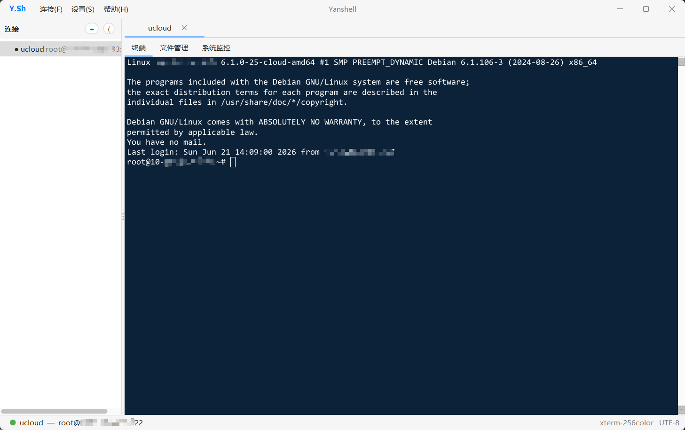

# Yanshell

一个轻量级的 SSH 终端客户端，使用 **Java + Swing** 编写。
终端模拟基于 **JediTerm**，SSH 层基于 **Apache MINA SSHD**，外观采用 **FlatLaf**。

> 集终端、文件管理、系统监控于一体的桌面 SSH 工具，连接信息本地加密保存。

## 运行截图



## 功能特性

- **连接管理**：左侧连接树，支持文件夹分组、新建 / 编辑 / 删除会话，配置自动持久化。
- **多会话标签页**：可同时打开多个 SSH 会话，每个会话独立一个标签页。
- **三合一会话视图**，每个会话内含：
  - **终端**：深蓝配色，完整 PTY（`Ctrl+C`、方向键、`vim`、`less` 等正常工作），窗口缩放自动发送 `SIGWINCH`。
  - **文件管理**：基于 SFTP 的远程文件浏览。
  - **系统监控**：通过远程命令采集主机状态。
- **认证方式**：密码认证、私钥认证（PEM / OpenSSH，支持口令），或两者并用。
- **主机密钥校验**：基于 `known_hosts`，遇到未知 / 变更的密钥会弹窗确认。
- **凭据加密存储**：密码与私钥口令使用 **AES-256-GCM** 加密后写入本地，明文不落盘。
- **主题切换**：FlatLaf 亮 / 暗主题，可在设置中切换并记忆。

## 技术栈

| 组件 | 用途 | 版本 |
|------|------|------|
| JediTerm (core + ui) | 终端模拟与渲染 | 3.53 |
| Apache MINA SSHD (core + sftp) | SSH / SFTP | 2.13.2 |
| FlatLaf (+ extras) | Swing 现代扁平外观 | 3.7.1 |
| Jackson Databind | 配置 JSON 序列化 | 2.17.2 |
| SLF4J + Logback | 日志 | 2.0.13 / 1.5.6 |

## 环境要求

- **JDK 17+**
- **Maven 3.9+**
- 首次构建需要联网：JediTerm 3.x 仅托管在 JetBrains 的 Maven 仓库
  （已在 `pom.xml` 中声明，国内默认走阿里云镜像）。

## 构建与运行

```bash
# 在项目根目录
mvn clean package

# 运行打包好的 fat jar
java -jar target/yanshell.jar
```

开发期间也可直接用 Maven 运行：

```bash
mvn compile exec:java
```

若在某些 JDK 上遇到模块访问告警，可加：

```bash
java --add-opens java.desktop/sun.awt=ALL-UNNAMED \
     --add-opens java.desktop/java.awt=ALL-UNNAMED \
     -jar target/yanshell.jar
```

## 使用说明

1. 点击连接列表上方的 **+** 新建连接，或新建文件夹分组。
2. 在会话对话框中填写：
   - 主机 / 端口 / 用户名（必填）
   - 密码（密码认证），**或**
   - 私钥路径 + 可选口令（密钥认证）
3. 双击连接项打开会话，会话以标签页形式呈现，内含 **终端 / 文件管理 / 系统监控** 三个子页。
4. 终端内复制 / 粘贴沿用 JediTerm 默认快捷键（Windows/Linux：`Ctrl+Shift+C` / `Ctrl+Shift+V`）。
5. 关闭标签页即断开对应会话。

## 配置与数据

所有数据保存在用户主目录下的 `~/.yanshell/`：

| 文件 | 内容 |
|------|------|
| `connections.json` | 连接树（文件夹 + 会话），密码 / 口令字段已加密 |
| `.key` | AES-256-GCM 主密钥，首次运行自动生成 |

> ⚠️ 加密密钥与加密数据存在同一目录，这能防止配置文件被随手翻看，但**不能**抵御能完整读取你主目录的攻击者。删除或丢失 `.key` 后，已保存的密码将无法解密（解密返回空，需重新输入）。

## 项目结构

```
src/main/java/com/yanshell/
├── Main.java                 # 入口：应用主题、显示主窗口
├── core/                     # 与 UI / SSH 无关的领域模型
│   ├── TerminalInput.java    #   接口：按键 -> SSH
│   ├── TerminalOutput.java   #   接口：字节 <- SSH
│   ├── ConnectionNode.java   #   连接树节点（文件夹 / 会话）
│   ├── ConnectionFolder.java
│   ├── ConnectionProfile.java
│   ├── ConnectionStore.java  #   连接树持久化（JSON + 加密）
│   ├── RemoteEntry.java      #   远程文件条目
│   └── AppSettings.java      #   主题等应用设置
├── ssh/                      # 纯网络层，绝不触碰 Swing
│   ├── SSHConfig.java        #   不可变连接参数
│   ├── SSHClient.java        #   MINA SSHD 封装：会话 + shell 通道
│   ├── ExecService.java      #   远程命令执行（系统监控用）
│   ├── KnownHostsStore.java  #   known_hosts 读写
│   └── KnownHostsVerifier.java #  主机密钥校验
├── sftp/
│   └── SftpService.java      # SFTP 子系统封装
├── terminal/                 # 仅负责显示，绝不开 socket
│   ├── SshTtyConnector.java  #   SSHClient <-> JediTerm 适配器
│   └── TerminalPanel.java    #   承载 JediTermWidget
├── ui/                       # Swing 界面
│   ├── MainFrame.java        #   主窗口：侧栏 + 会话标签 + 状态栏
│   ├── SessionPanel.java     #   左侧连接树
│   ├── SessionView.java      #   单个会话视图（终端/文件/监控）
│   ├── SessionDialog.java    #   新建 / 编辑会话
│   ├── FileManagerPanel.java #   文件管理面板
│   ├── MonitorPanel.java     #   系统监控面板
│   ├── SettingsDialog.java   #   设置（主题）
│   └── FolderNameDialog.java
└── util/
    ├── CryptoUtil.java       # AES-256-GCM 加解密
    ├── ThemeManager.java     # FlatLaf 主题管理
    └── LogUtil.java
```

### 分层约定

- `terminal/` 只负责显示，**不**打开网络连接。
- `ssh/` 只负责 I/O，**不**触碰 Swing。
- 两侧只通过 `core/` 中的 `TerminalInput` / `TerminalOutput` 接口通信。
- 所有 SSH 工作运行在后台线程，所有 UI 变更经由 `SwingUtilities.invokeLater`。

## 已知限制

- 凭据加密的安全边界仅限于"防止明文落盘"（见上文配置说明）。
- 暂不支持端口转发、Agent 转发、代理跳转。
- 认证使用预先配置的密码 / 密钥；密码错误时不会弹出交互式密码框，仅提示"连接失败"。
